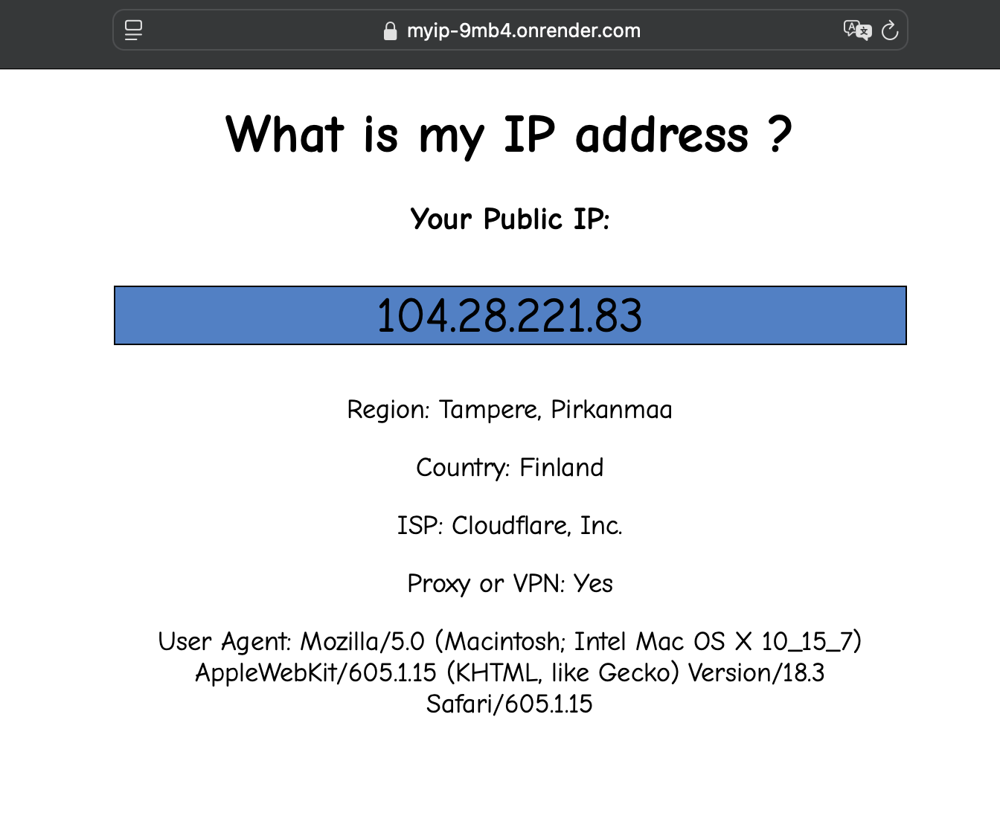

# MyIP

MyIP is a simple web application for checking your public IP and relevant information

Link: <https://seemyaddr.org>

Temporary demo link (wait to start up if inactive):
<https://myip-9mb4.onrender.com>

This project's structure is set up by using `uv` package manager <https://github.com/astral-sh/uv> but `pip` can also be used normally.

## Run application with Docker

At the root directory, run:
`docker build -t myip:1.0 .`

Then
`docker run --name myip -dp 8500:8500 myip:1.0 .`

## Run locally

After cloning, either run
`uv add -r requirements.txt` OR
`pip install -r requirements.txt` to install dependencies.

To run: `python src/ip.py`

