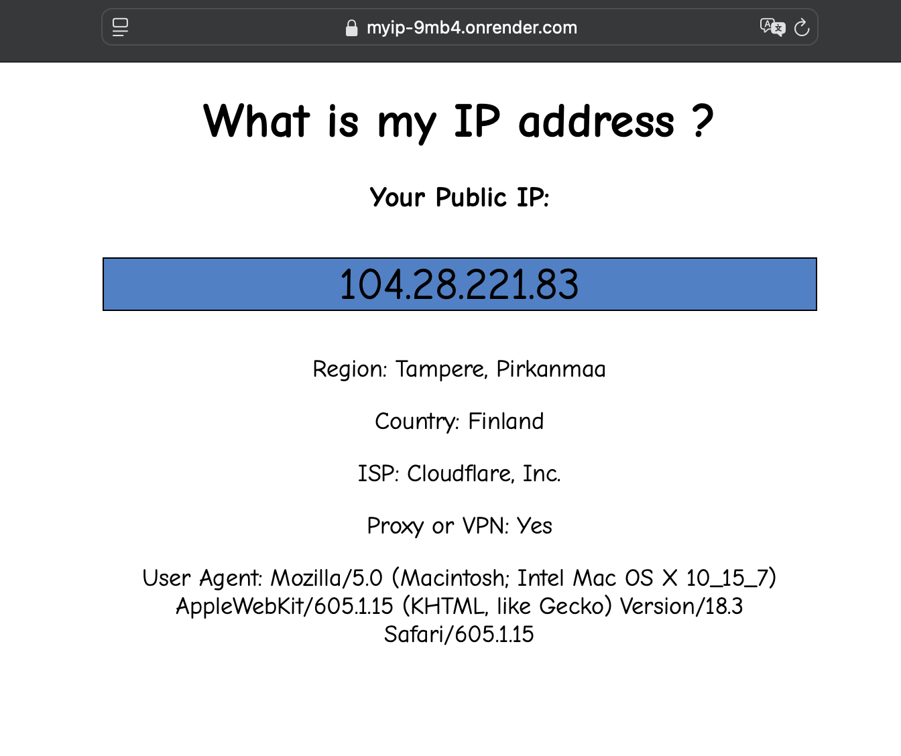

# MyIP

MyIP is a small web application that reports the public IP address of whoever
visits it, along with geolocation details.

Link: <https://seemyaddr.org>

The project is managed with the [`uv`](https://github.com/astral-sh/uv) package
manager, but plain `pip` can also be used.

## Endpoints

| Endpoint | Description |
|----------|-------------|
| `/` | HTML page with the visitor's IP and geolocation. When the user agent is `curl` or `wget`, returns just the bare IP as plain text. |
| `/json` | The same information as JSON. |
| `/ip` | The bare IP address as plain text, regardless of user agent. |
| `/healthz` | `{"status": "ok"}` — used by the container healthcheck. |
| `/?ip=<address>` or `/json?ip=<address>` | Look up a specific public IP instead of the visitor's own. Non-public addresses are rejected (`400`) and the endpoint is rate limited per client (`429`). |

### curl examples

```bash
curl https://seemyaddr.org            # plain IP (curl user agent)
curl https://seemyaddr.org/json       # JSON
curl https://seemyaddr.org/ip         # plain IP
curl "https://seemyaddr.org/json?ip=8.8.8.8"   # look up another address
```

## Configuration

All settings are read from environment variables.

| Variable | Default | Description |
|----------|---------|-------------|
| `MYIP_PORT` | `8500` | Port the server listens on. |
| `MYIP_LOG_LEVEL` | `INFO` | Log level (`DEBUG`, `INFO`, `WARNING`, `ERROR`). |
| `MYIP_TRUST_PROXY` | `true` | Trust `CF-Connecting-IP` / `X-Forwarded-For` headers. Set to `false` when the port is exposed directly (otherwise clients can spoof their IP). |
| `MYIP_LOOKUP_RATE_LIMIT` | `30` | `?ip=` lookups allowed per minute per client. `0` disables the limit. |

## Run locally

With `uv`:

```bash
uv sync
source .venv/bin/activate
python src/ip.py
```

With `pip`:

```bash
pip install -r requirements.txt
python src/ip.py
```

The `requirements*.txt` files are generated from `uv.lock` and should not be
edited by hand:

```bash
uv export --format requirements-txt --no-hashes --no-dev --no-emit-project -o requirements.txt
uv export --format requirements-txt --no-hashes --only-dev --no-emit-project -o requirements-test.txt
```

## Run with Docker

At the root directory:

```bash
docker build -t myip:1.0 .
docker run --name myip -dp 8500:8500 myip:1.0
```

## Development

```bash
uv sync                # installs runtime + dev dependencies
uv run pytest -q       # run the test suite
uv run ruff check .    # lint
```

## Data source and privacy

Geolocation is provided by [ip-api.com](http://ip-api.com). The visitor's IP
address (and, for the `?ip=` form, the requested address) is sent to that
service to produce the result. The user agent string is shown on the page but
is not sent to ip-api.com.


